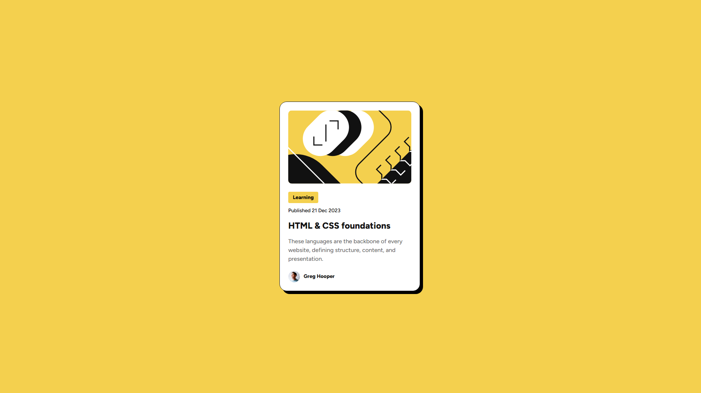

# 🌟 Blog Preview Card Component - Frontend Mentor Solution 🌟

This repository contains my solution for the [Blog Preview Card Challenge on Frontend Mentor](https://www.frontendmentor.io/challenges/blog-preview-card-component-2OUzrvlsjw). It’s a fun and responsive design challenge, perfect for honing front-end skills. 🚀

---

## 📋 Table of Contents

- [🔍 Overview](#-overview)
    - [🖼 Screenshot](#-screenshot)
    - [🔗 Links](#-links)
- [⚙️ My Process](#-my-process)
    - [🛠 Built With](#-built-with)
    - [📚 What I Learned](#-what-i-learned)
- [👨‍💻 Author](#-author)

---

## 🔍 Overview

### 🖼 Screenshot

### 🔗 Links

- [📂 Repository](https://github.com/Hamptooon/block-preview-card)
- [🌐 Live Demo](https://your-username.github.io/blog-preview-component)

---

## ⚙️ My Process

### 🛠 Built With

- ✅ **Semantic HTML5**
- 🎨 **CSS for styling**
- 🧩 **Flexbox**
- 📱 **Mixins**

### 📚 What I Learned

This project improved my knowledge of:

- **Flexbox** for building complex layouts with ease.
- **Mixins** to make the style structure more modular. ✨

---

## 👨‍💻 Author

- GitHub - [Hamptooon](https://github.com/Hamptooon)
- Frontend Mentor - [Hamptooon](https://hamptooon.github.io/block-preview-card/)

---

🔧 This project is part of my continuous learning journey in front-end development. Feel free to fork or star[⭐️]! 

