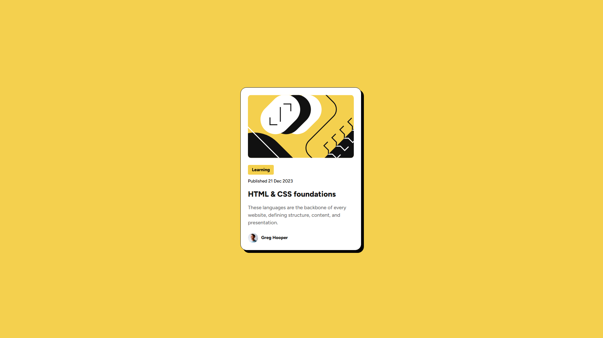

# 🌟 Компонент "Block review card" - Решение Frontend Mentor 🌟

В этом репозитории находится моё решение для [челленджа "Blog Preview Card" на Frontend Mentor](https://www.frontendmentor.io/challenges/blog-preview-card-component-2OUzrvlsjw). Это интересный и адаптивный дизайн-челлендж, который отлично подходит для оттачивания навыков фронтенд-разработки. 🚀

---

## 📋 Содержание

- [🔍 Обзор](#-обзор)
    - [🖼 Скриншот](#-скриншот)
    - [🔗 Ссылки](#-ссылки)
- [⚙️ Мой процесс](#-мой-процесс)
    - [🛠 Используемые технологии](#-используемые-технологии)
    - [📚 Чему я научился](#-чему-я-научился)
- [👨‍💻 Автор](#-автор)

---

## 🔍 Обзор

### 🖼 Скриншот

### 🔗 Ссылки

- [📂 Репозиторий](https://github.com/Hamptooon/block-preview-card)
- [🌐 Живой пример](https://Hamptooon.github.io/block-preview-card)

---

## ⚙️ Мой процесс

### 🛠 Используемые технологии

- ✅ **Семантический HTML5**
- 🎨 **CSS для стилизации**
- 🧩 **Flexbox для компоновки**
- 📱 **Миксины**

### 📚 Чему я научился

Этот проект помог мне улучшить навыки:

- **Flexbox** для создания сложных макетов.
- **Миксинов** для модульной структуры стилей. ✨

---

## 👨‍💻 Автор

- GitHub - [Hamptooon](https://github.com/Hamptooon)
- Frontend Mentor - [Hamptooon](https://hamptooon.github.io/block-preview-card/)

---

🔧 Этот проект является частью моего непрерывного обучения фронтенд-разработке. Не стесняйтесь форкать или ставить ⭐️!

